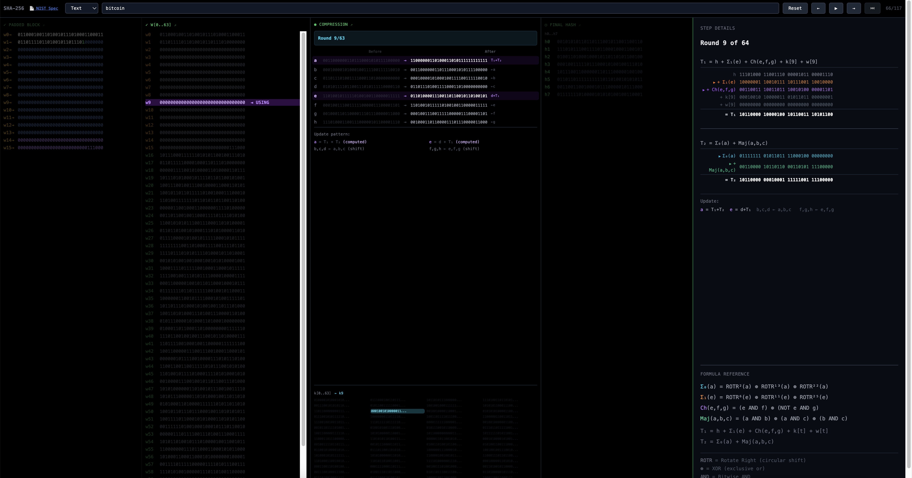

# SHA-256 Visualizer



An interactive visual explanation of the SHA-256 hash algorithm. 
 Learn how hashing works step by step with animatio
See how your input transforms into a 256-bit hash through padding, message scheduling, and 64 rounds of compression.

**Live demo:** https://hashexplained.com

## Limitations

Currently supports single-block messages only (up to 55 characters). Multi-block support for longer inputs is not yet implemented.

## Development

```bash
npm install
npm start
```
